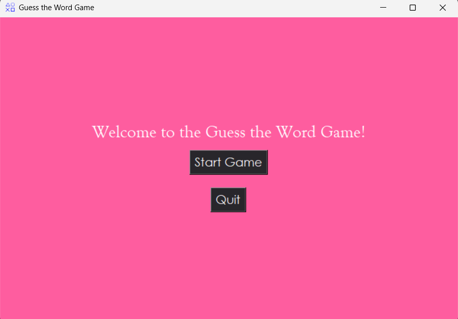
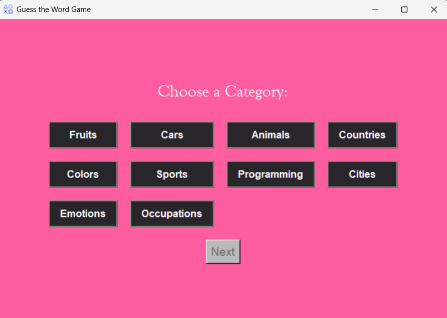
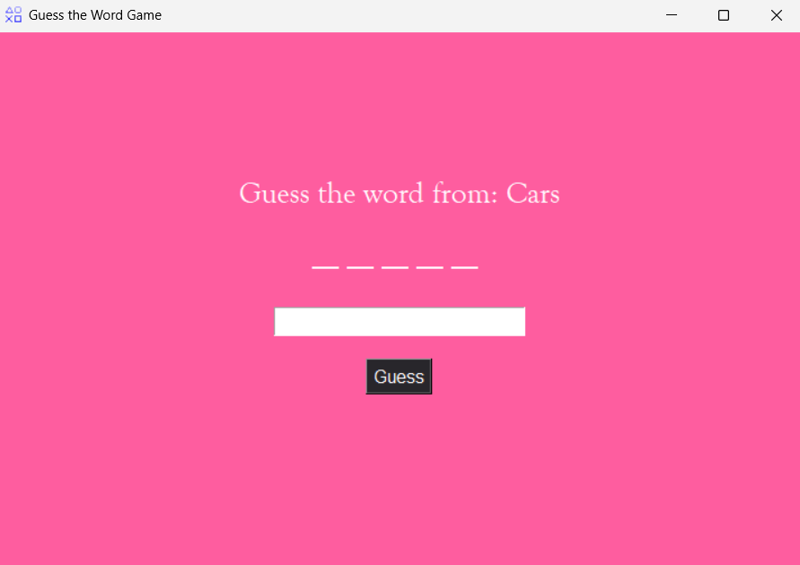
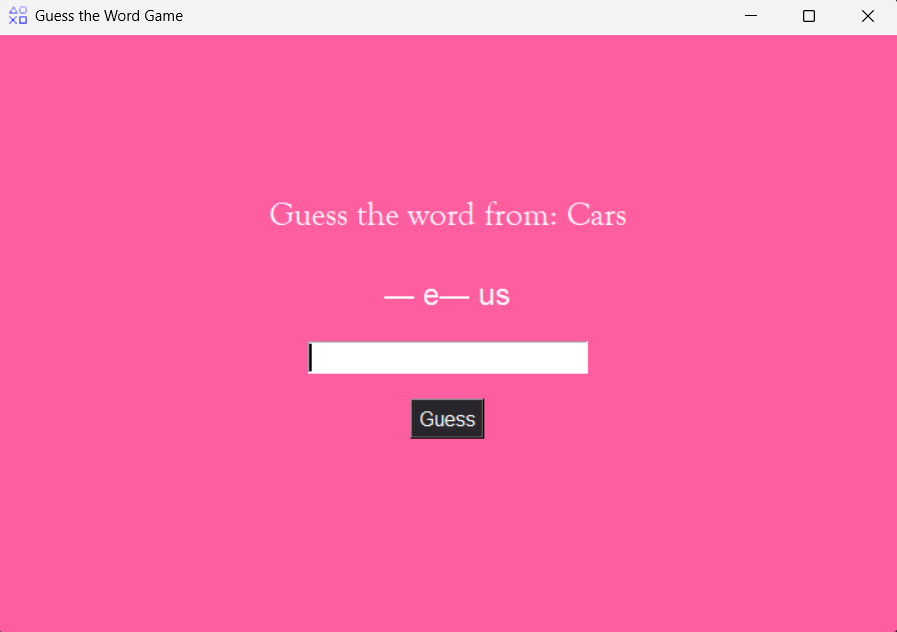
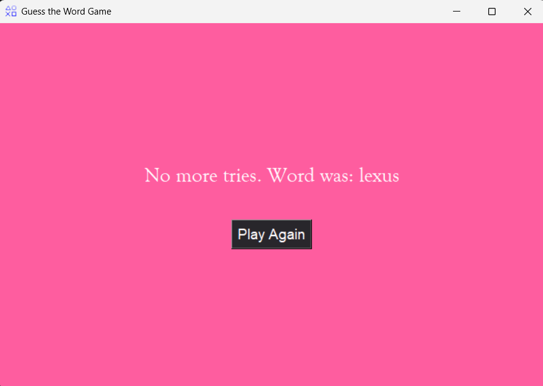
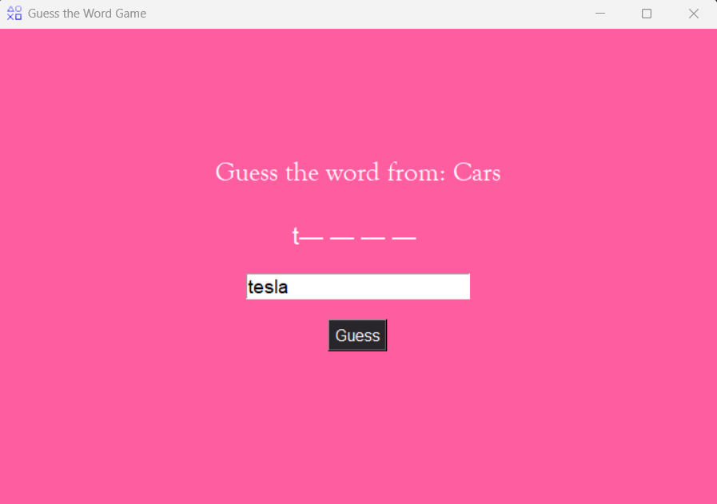
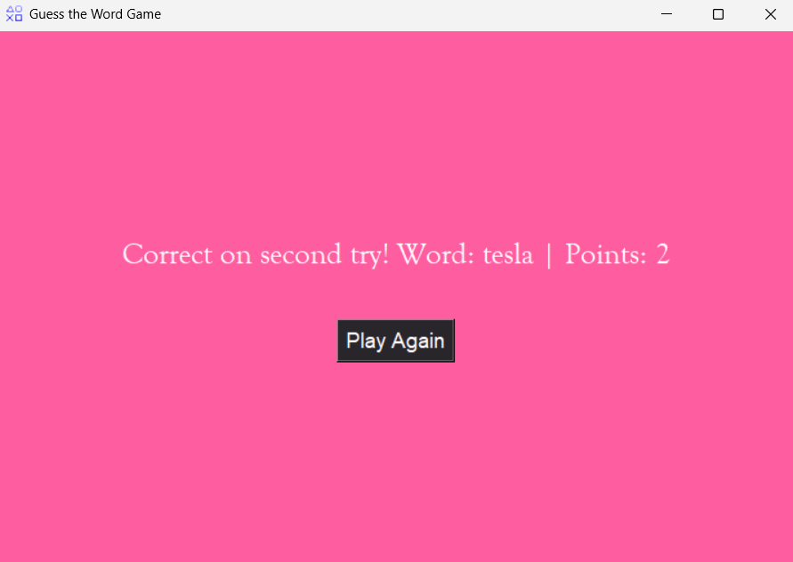

# Guess the Word Game 

A fun word-guessing game built using Python and Tkinter! Choose a category, guess the word, and earn points based on the number of attempts.

## Features
- **Category Selection:** Pick from various word categories stored in `categories.json`.
- **Interactive UI:** Visually structured layout with buttons to improve user experience.
- **Dynamic Hints:** Progressive hints with vowels and starting letters.
- **Scoring System:** Earn points based on how quickly you guess the word.
- **Minimalist Design:** Styled using a custom color palette for aesthetics.

## Screenshots 📸
<p float="left">
  
  
  
  
  
  
  
</p>


## Installation 📦
1. Clone the repository:
   ```sh
   git clone https://github.com/Sanaapathann/guess-the-word.git
